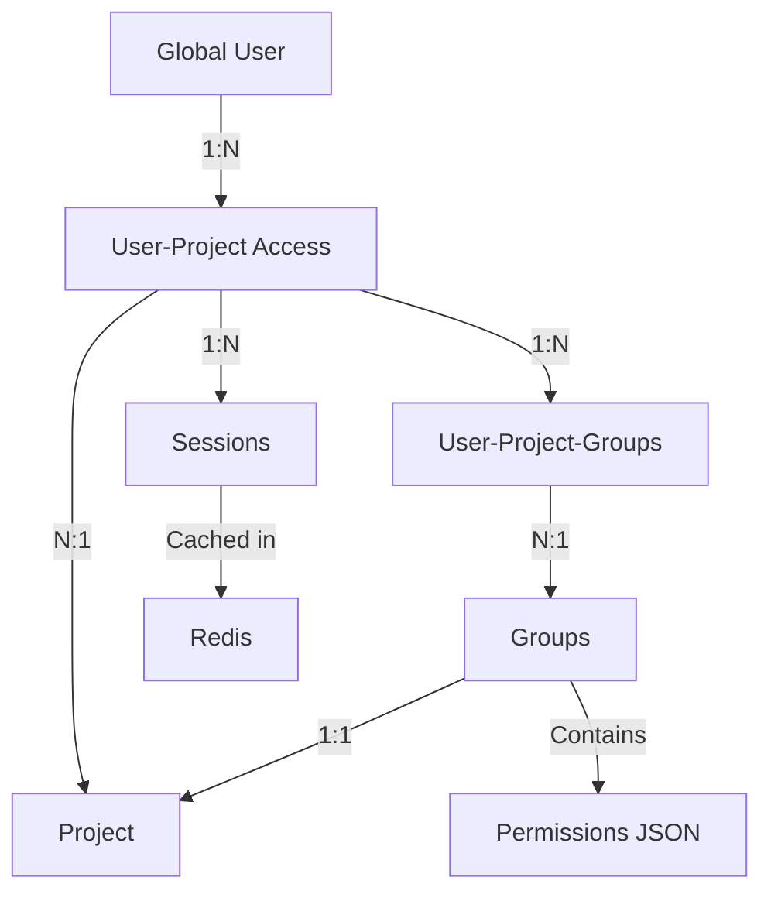
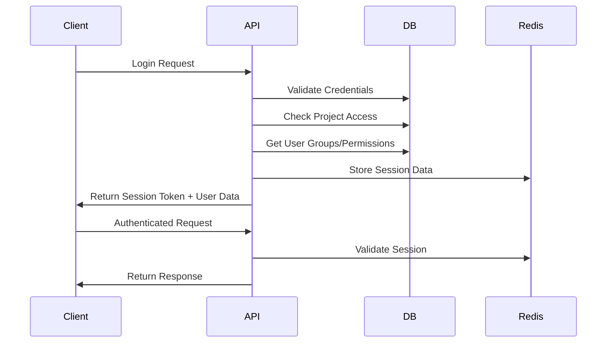

# Enhanced Multi-Project Authentication System

## Overview

This enhanced authentication system provides a complete solution for multi-project user management with the following key features:

- **Project Isolation**: Users are isolated by project by default
- **Cross-Project Access**: Same user can access multiple projects with same credentials
- **Project Fusion**: Ability to merge project access for existing users
- **Group-Based Permissions**: Flexible permission system through user groups
- **Global User Identity**: Single user account can map to multiple projects
- **Legacy Compatibility**: Maintains backward compatibility with existing API

## Architecture



## Key Concepts

### 1. Global Users
- Single identity across all projects
- Global username/email uniqueness
- Shared password across projects

### 2. Project Isolation
- Users must be explicitly granted access to projects
- Each user-project relationship has unique hash
- Default assignment to 'user' group

### 3. Group-Based Permissions
- Projects define their own groups and permissions
- Users inherit permissions from all their groups
- Flexible JSON-based permission system

### 4. Session Management
- Redis-based session storage for performance
- Database backup for session tracking
- Support for project switching

## Installation and Setup

### 1. Database Setup

Create the enhanced database schema:

```sql
CREATE DATABASE magic_auth_enhanced;
USE magic_auth_enhanced;

-- Run the table creation scripts from DATABASE_SCHEMA.md
-- (See DATABASE_SCHEMA.md for complete SQL)
```

### 2. Environment Variables

```bash
# Database Configuration
DB_MYSQL_PASSWORD=your_mysql_password
DB_REDIS_PASSWORD=your_redis_password

# Optional: Set different database name
DB_DATABASE=magic_auth_enhanced
```

### 3. Install Dependencies

```bash
pip install -r requirements.txt
```

### 4. Initialize Default Data

```python
from src.Util.db_enhanced import create_project

# Create your first project
project = create_project("My First Project", "Description of the project")
print(f"Project created with hash: {project.project_hash}")
```

## API Endpoints

### Enhanced Endpoints

#### `POST /user-enhanced/login`
Login to a specific project.

```bash
curl -X POST "http://localhost:8000/user-enhanced/login" \
  -H "Content-Type: application/x-www-form-urlencoded" \
  -d "username=john_doe&password=secret123&project_hash=ABC123..."
```

**Response:**
```json
{
  "success": true,
  "session_token": "DEF456...",
  "user": {
    "user_hash": "GHI789...",
    "user_id": 1,
    "user_project_id": 1,
    "user_project_hash": "JKL012..."
  },
  "project": {
    "project_hash": "ABC123...",
    "project_name": "My Project",
    "project_id": 1
  },
  "access": {
    "groups": ["user"],
    "permissions": ["read", "write"]
  },
  "available_projects": [
    {
      "project_hash": "ABC123...",
      "project_name": "My Project",
      "project_description": "Description"
    }
  ]
}
```

#### `POST /user-enhanced/register`
Register a new user or grant existing user access to project.

```bash
curl -X POST "http://localhost:8000/user-enhanced/register" \
  -H "Content-Type: application/x-www-form-urlencoded" \
  -d "username=jane_doe&password=secret456&project_hash=ABC123...&email=jane@example.com"
```

#### `GET /user-enhanced/profile`
Get current user profile (requires authentication).

```bash
curl -X GET "http://localhost:8000/user-enhanced/profile" \
  -H "Authorization: Bearer YOUR_SESSION_TOKEN"
```

#### `POST /user-enhanced/switch-project`
Switch to a different project.

```bash
curl -X POST "http://localhost:8000/user-enhanced/switch-project" \
  -H "Authorization: Bearer YOUR_SESSION_TOKEN" \
  -H "Content-Type: application/x-www-form-urlencoded" \
  -d "project_hash=XYZ789..."
```

#### `POST /user-enhanced/create-project`
Create a new project (admin permission required).

```bash
curl -X POST "http://localhost:8000/user-enhanced/create-project" \
  -H "Authorization: Bearer YOUR_SESSION_TOKEN" \
  -H "Content-Type: application/x-www-form-urlencoded" \
  -d "project_name=New Project&project_description=Description"
```

#### `POST /user-enhanced/grant-access`
Grant user access to project (admin permission required).

```bash
curl -X POST "http://localhost:8000/user-enhanced/grant-access" \
  -H "Authorization: Bearer YOUR_SESSION_TOKEN" \
  -H "Content-Type: application/x-www-form-urlencoded" \
  -d "username=john_doe&target_project_hash=XYZ789..."
```

### Legacy Endpoints (Maintained for Compatibility)

All existing endpoints continue to work:
- `POST /user/login`
- `POST /user/register`
- `POST /user/check`

## Usage Examples

### Example 1: Multi-Project User Flow

```python
from src.Util.db_enhanced import (
    create_project, enhanced_register, enhanced_login, 
    grant_user_project_access, get_user_by_credentials
)

# 1. Create two projects
project_a = create_project("Project A", "First project")
project_b = create_project("Project B", "Second project")

# 2. Register user to Project A
user_login_a = enhanced_register("john_doe", "password123", "john@example.com", project_a.project_hash)
print(f"User registered to Project A: {user_login_a.user_hash}")

# 3. Grant same user access to Project B
user = get_user_by_credentials("john_doe", "password123")
grant_user_project_access(user.id, project_b.id)

# 4. User can now login to either project
login_a = enhanced_login("john_doe", "password123", project_a.project_hash)
login_b = enhanced_login("john_doe", "password123", project_b.project_hash)

print(f"Projects available: {len(login_a.available_projects)}")
```

### Example 2: Project Fusion

```python
# Scenario: Merge two apps and give existing users access to both

def fuse_projects(source_project_hash, target_project_hash):
    """Grant all users from source project access to target project"""
    from src.Util.db_enhanced import get_connection, get_project_by_hash, grant_user_project_access
    
    source_project = get_project_by_hash(source_project_hash)
    target_project = get_project_by_hash(target_project_hash)
    
    with get_connection() as con:
        cur = con.cursor()
        
        # Get all users from source project
        cur.execute("""
            SELECT DISTINCT user_id FROM user_projects 
            WHERE project_id = %s AND is_active = 1
        """, [source_project.id])
        
        user_ids = [row[0] for row in cur.fetchall()]
        
        # Grant each user access to target project
        for user_id in user_ids:
            try:
                grant_user_project_access(user_id, target_project.id)
                print(f"Granted user {user_id} access to {target_project.project_name}")
            except Exception as e:
                print(f"User {user_id} already has access or error: {e}")

# Usage
fuse_projects("PROJECT_A_HASH", "PROJECT_B_HASH")
```

### Example 3: Permission Management

```python
from src.Util.db_enhanced import get_user_permissions_in_project, get_connection

def assign_admin_role(user_project_id):
    """Promote user to admin role in their project"""
    with get_connection() as con:
        cur = con.cursor()
        
        # Get project ID from user_project
        cur.execute("SELECT project_id FROM user_projects WHERE id = %s", [user_project_id])
        project_id = cur.fetchone()[0]
        
        # Get admin group ID
        cur.execute("""
            SELECT id FROM user_groups 
            WHERE project_id = %s AND group_name = 'admin'
        """, [project_id])
        admin_group_id = cur.fetchone()[0]
        
        # Remove from current groups
        cur.execute("""
            UPDATE user_project_groups 
            SET is_active = 0 
            WHERE user_project_id = %s
        """, [user_project_id])
        
        # Add to admin group
        cur.execute("""
            INSERT INTO user_project_groups (user_project_id, group_id, assigned_at)
            VALUES (%s, %s, NOW())
        """, [user_project_id, admin_group_id])
        
        con.commit()
        
    # Verify new permissions
    permissions = get_user_permissions_in_project(user_project_id)
    print(f"New permissions: {permissions}")
```

## Migration from Legacy System

### Step 1: Backup Current Data

```bash
mysqldump magic_auth > backup_$(date +%Y%m%d).sql
```

### Step 2: Run Migration Script

```python
# Create migration script: migrate_to_enhanced.py

from src.Util.db import get_connection as get_legacy_connection
from src.Util.db_enhanced import get_connection as get_enhanced_connection
import pymysql

def migrate_legacy_to_enhanced():
    """Migrate from legacy tb_collection* tables to enhanced schema"""
    
    # Step 1: Create enhanced database and tables
    with get_enhanced_connection() as con:
        # Tables are created automatically when connecting
        pass
    
    # Step 2: Migrate collections to projects
    with get_legacy_connection() as legacy_con, get_enhanced_connection() as enhanced_con:
        legacy_cur = legacy_con.cursor()
        enhanced_cur = enhanced_con.cursor()
        
        # Migrate collections
        legacy_cur.execute("SELECT id_collection, collection_hash FROM magic_auth.tb_collection")
        collections = legacy_cur.fetchall()
        
        for collection_id, collection_hash in collections:
            enhanced_cur.execute("""
                INSERT IGNORE INTO projects (project_hash, project_name, project_created)
                VALUES (%s, %s, NOW())
            """, [collection_hash, f"Legacy Project {collection_id}"])
        
        # Migrate users
        legacy_cur.execute("""
            SELECT DISTINCT user_name, user_email, user_password, user_hash, user_creation
            FROM magic_auth.tb_collection_user
        """)
        users = legacy_cur.fetchall()
        
        for username, email, password_hash, user_hash, created in users:
            enhanced_cur.execute("""
                INSERT IGNORE INTO users (username, email, password_hash, user_hash, created_at)
                VALUES (%s, %s, %s, %s, %s)
            """, [username, email, password_hash, user_hash, created])
        
        # Migrate user-project relationships
        legacy_cur.execute("""
            SELECT tcu.user_hash, tc.collection_hash, tcu.user_creation
            FROM magic_auth.tb_collection_user tcu
            JOIN magic_auth.tb_collection tc ON tc.id_collection = tcu.id_collection
        """)
        relationships = legacy_cur.fetchall()
        
        for user_hash, collection_hash, granted_at in relationships:
            enhanced_cur.execute("""
                INSERT IGNORE INTO user_projects (user_id, project_id, user_project_hash, granted_at)
                SELECT u.id, p.id, %s, %s
                FROM users u, projects p
                WHERE u.user_hash = %s AND p.project_hash = %s
            """, [user_hash, granted_at, user_hash, collection_hash])
        
        enhanced_con.commit()
        print("Migration completed successfully!")

if __name__ == "__main__":
    migrate_legacy_to_enhanced()
```

### Step 3: Update Application Configuration

```python
# In main.py, add enhanced routes
from src.routes import UserEnhanced

app.include_router(UserEnhanced.router,
                   prefix='/user-enhanced',
                   tags=['Enhanced Multi-Project Authentication'])
```

### Step 4: Test Migration

```python
# Test script
from src.Util.db_enhanced import enhanced_login

# Test login with legacy credentials
result = enhanced_login("existing_username", "existing_password", "existing_collection_hash")
if result:
    print("Migration successful - user can login with enhanced system")
    print(f"Available projects: {len(result.available_projects)}")
else:
    print("Migration failed - check data and try again")
```

## Configuration

### Redis Configuration
The system uses Redis for session caching. Configure in your environment:

```bash
REDIS_HOST=192.168.1.90
REDIS_PORT=6379
REDIS_DB=0
REDIS_PASSWORD=your_redis_password
```

### Database Configuration
Update database connection settings:

```python
# In db_enhanced.py
connectionDB = {
    "host": os.environ.get("DB_HOST", "192.168.1.90"),
    "user": os.environ.get("DB_USER", "root"),
    "password": os.environ.get("DB_MYSQL_PASSWORD"),
    "database": os.environ.get("DB_DATABASE", "magic_auth_enhanced")
}
```

## Security Features

### 1. Password Security
- SHA256 password hashing (maintains legacy compatibility)
- Global password for cross-project access
- Optional password rotation support

### 2. Session Security
- Secure token generation using `secrets` module
- Session expiration (default: 3 days)
- Session invalidation on project switch

### 3. Access Control
- Multi-layered permission system
- Audit trail for access grants/revocations
- Soft deletes for data integrity

### 4. Authentication Flow


## Performance Considerations

### 1. Database Optimization
- Strategic indexing on frequently queried columns
- Connection pooling for high concurrency
- Query optimization for permission checks

### 2. Redis Caching
- Session data cached for fast authentication
- Configurable TTL for session expiration
- Fallback to database if Redis unavailable

### 3. Monitoring
```python
# Example monitoring setup
import time
import logging

def monitor_db_performance():
    """Monitor database query performance"""
    start_time = time.time()
    # Your database operation
    end_time = time.time()
    
    if end_time - start_time > 0.5:  # Slow query threshold
        logging.warning(f"Slow query detected: {end_time - start_time:.2f}s")
```

## Troubleshooting

### Common Issues

1. **Migration Fails**: Check database permissions and foreign key constraints
2. **Session Issues**: Verify Redis connection and configuration
3. **Permission Denied**: Check user group assignments and permissions
4. **Duplicate Users**: Ensure username/email uniqueness before migration

### Debug Mode

```python
# Enable debug logging
import logging
logging.basicConfig(level=logging.DEBUG)

# Test connection
from src.Util.db_enhanced import get_connection
try:
    with get_connection() as con:
        print("Database connection successful")
except Exception as e:
    print(f"Database connection failed: {e}")
```

## Future Enhancements

### Planned Features
1. **Role Templates**: Pre-defined role templates for common use cases
2. **Advanced Permissions**: Time-based and conditional permissions
3. **SSO Integration**: SAML/OAuth integration for enterprise
4. **API Keys**: Machine-to-machine authentication
5. **Audit Dashboard**: Web UI for access management

### Extensibility
The system is designed to be extensible:
- Custom permission types through JSON schema
- Plugin architecture for additional authentication methods
- Webhook support for external integrations

## Support

For questions and support:
1. Check the DATABASE_SCHEMA.md for detailed table structure
2. Review the code examples in this README
3. Test with the provided migration script
4. Create issues for bugs or feature requests

This enhanced system provides a robust foundation for multi-project authentication while maintaining backward compatibility and supporting all your requirements for user isolation, cross-project access, and group-based permissions. 