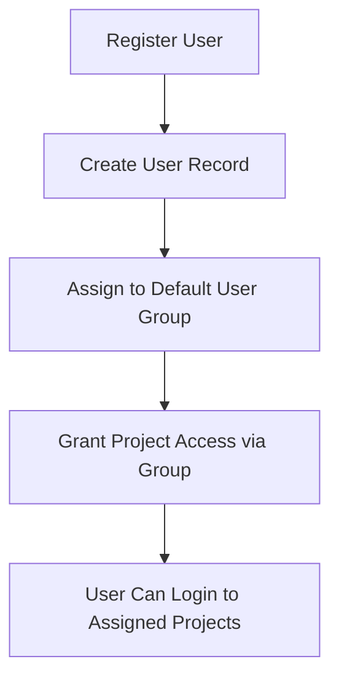
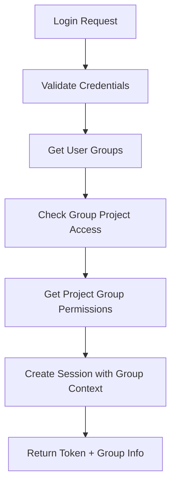
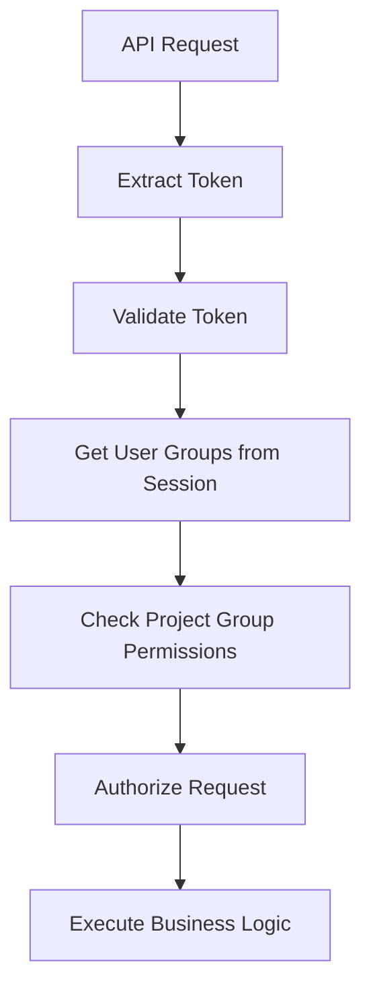

# Authentication API

Complete authentication endpoint documentation for the **3-Tier User Type Multi-Project Authentication** system.

## 🔐 Overview

All authenticated endpoints require a session token in the Authorization header:

```
Authorization: Bearer YOUR_SESSION_TOKEN
```

## 🏗️ 3-Tier User Type System

The authentication system supports three distinct user types:

1. **ROOT USERS**: Super administrators with unrestricted global access
2. **ADMIN USERS**: Project-specific administrators limited to their assigned project  
3. **CONSUMER USERS**: End users with RBAC-based permissions through groups

## 🎯 Core Authentication Flow

```
1. Login → Get session token with user type & group context
2. Use token → Access resources based on user type privileges
3. Switch projects → Get new token for different project (if allowed by user type)
4. Logout → Invalidate session
```

---

## 📡 Authentication Endpoints

### POST `/auth/login`

Group-based login to a specific project.

**Request Body** (form-data):
- `username` (required): User's username
- `password` (required): User's password
- `project_hash` (required): Project hash to login to

**Example Request:**
```bash
curl -X POST "http://localhost:8000/auth/login" \
  -H "Content-Type: application/x-www-form-urlencoded" \
  -d "username=admin&password=admin123&project_hash=abc123..."
```

**Success Response (200):**
```json
{
  "success": true,
  "message": "Login successful",
  "session_token": "def456...",
  "user": {
    "user_hash": "ghi789...",
    "username": "admin",
    "email": "admin@example.com",
    "user_type": "root",
    "user_groups": ["administrators"]
  },
  "project": {
    "project_hash": "abc123...",
    "project_name": "My Project",
    "permissions": ["admin", "read", "write", "delete", "manage_users"]
  },
  "accessible_projects": [
    {
      "project_hash": "abc123...",
      "project_name": "My Project",
      "project_description": "Project description"
    }
  ],
  "expires_at": "2024-01-04T12:00:00Z"
}
```

**Error Response (401):**
```json
{
  "success": false,
  "detail": "Invalid credentials"
}
```

---

### POST `/auth/register`

Register a new user and assign them to a user group.

**Request Body** (form-data):
- `username` (required): Desired username
- `password` (required): User's password
- `email` (required): User's email address
- `project_hash` (required): Project hash to register for

**Example Request:**
```bash
curl -X POST "http://localhost:8000/auth/register" \
  -H "Content-Type: application/x-www-form-urlencoded" \
  -d "username=john_doe&password=password123&email=john@example.com&project_hash=abc123..."
```

**Success Response (200):**
```json
{
  "success": true,
  "message": "User registered successfully",
  "user": {
    "user_hash": "new_user_hash...",
    "username": "john_doe",
    "email": "john@example.com",
    "user_type": "consumer",
    "user_groups": []
  },
  "project": {
    "project_hash": "abc123...",
    "project_name": "My Project"
  }
}
```

---

### GET `/auth/validate`

Validate session token and return user information with group context.

**Authentication:** Required

**Example Request:**
```bash
curl -X GET "http://localhost:8000/auth/validate" \
  -H "Authorization: Bearer YOUR_SESSION_TOKEN"
```

**Response (200):**
```json
{
  "success": true,
  "valid": true,
  "user": {
    "user_hash": "ghi789...",
    "username": "admin",
    "email": "admin@example.com",
    "user_type": "root",
    "user_groups": ["administrators"]
  },
  "project": {
    "project_hash": "abc123...",
    "project_name": "My Project",
    "permissions": ["admin", "read", "write", "delete"]
  },
  "session": {
    "expires_at": "2024-01-04T12:00:00Z",
    "created_at": "2024-01-01T12:00:00Z"
  }
}
```

---

### POST `/auth/logout`

Logout user and invalidate session.

**Authentication:** Required

**Example Request:**
```bash
curl -X POST "http://localhost:8000/auth/logout" \
  -H "Authorization: Bearer YOUR_SESSION_TOKEN"
```

**Response (200):**
```json
{
  "success": true,
  "message": "Logged out successfully"
}
```

---

### POST `/auth/switch-project`

Switch to a different project that the user's group has access to.

**Authentication:** Required

**Request Body** (form-data):
- `project_hash` (required): Hash of the project to switch to

**Example Request:**
```bash
curl -X POST "http://localhost:8000/auth/switch-project" \
  -H "Authorization: Bearer YOUR_SESSION_TOKEN" \
  -H "Content-Type: application/x-www-form-urlencoded" \
  -d "project_hash=xyz789..."
```

**Response (200):**
```json
{
  "success": true,
  "message": "Successfully switched to project: New Project",
  "session_token": "new_session_token...",
  "project": {
    "project_hash": "xyz789...",
    "project_name": "New Project",
    "permissions": ["read", "write"]
  },
  "user_groups": ["users"]
}
```

---

### POST `/auth/check-availability`

Check if username or email is available globally.

**Request Body** (form-data):
- `username` (optional): Username to check
- `email` (optional): Email to check

**Example Request:**
```bash
curl -X POST "http://localhost:8000/auth/check-availability" \
  -H "Content-Type: application/x-www-form-urlencoded" \
  -d "username=new_user&email=new@example.com"
```

**Response (200):**
```json
{
  "success": true,
  "username_available": true,
  "email_available": false
}
```

---

## 🔧 Authentication Middleware

### HEAD `/access`

Validate session token and check permissions (middleware endpoint).

**Authentication:** Required

**Example Request:**
```bash
curl -X HEAD "http://localhost:8000/access" \
  -H "Authorization: Bearer YOUR_SESSION_TOKEN"
```

**Response:**
- **204**: Token is valid and has required permissions
- **401**: Token is invalid or expired
- **403**: Token valid but insufficient permissions

---

## 🏗️ Group-Based Authentication Flow

### 1. User Registration & Group Assignment



### 2. Login Process with Groups



### 3. Request Authorization



---

## 🔐 Security Features

### Session Security
- **3-day default expiration**
- **Automatic cleanup of expired sessions**
- **Group context included in sessions**
- **Redis-based session storage for performance**

### Group-Based Security
- **Users only see projects their groups access**
- **Permissions determined by project groups**
- **Cross-project switching through user groups**
- **Complete audit trail of group assignments**

### Token Security
- **JWT-style session tokens**
- **Cryptographic signing**
- **Group information embedded**
- **Automatic refresh on project switch**

---

## 🧪 Testing Authentication

### Basic Authentication Test

```bash
#!/bin/bash

# Test authentication flow
echo "1. Testing registration..."
curl -X POST "http://localhost:8000/auth/register" \
  -H "Content-Type: application/x-www-form-urlencoded" \
  -d "username=testuser&password=testpass&email=test@example.com&project_hash=YOUR_PROJECT_HASH"

echo "2. Testing login..."
LOGIN_RESPONSE=$(curl -s -X POST "http://localhost:8000/auth/login" \
  -H "Content-Type: application/x-www-form-urlencoded" \
  -d "username=testuser&password=testpass&project_hash=YOUR_PROJECT_HASH")

echo "Login Response: $LOGIN_RESPONSE"

# Extract token
TOKEN=$(echo $LOGIN_RESPONSE | jq -r '.session_token')

echo "3. Testing token validation..."
curl -X GET "http://localhost:8000/auth/validate" \
  -H "Authorization: Bearer $TOKEN"

echo "4. Testing logout..."
curl -X POST "http://localhost:8000/auth/logout" \
  -H "Authorization: Bearer $TOKEN"
```

### Group-Based Access Test

```bash
#!/bin/bash

# Test group-based access
echo "1. Login as admin..."
ADMIN_RESPONSE=$(curl -s -X POST "http://localhost:8000/auth/login" \
  -H "Content-Type: application/x-www-form-urlencoded" \
  -d "username=admin&password=admin123&project_hash=YOUR_PROJECT_HASH")

ADMIN_TOKEN=$(echo $ADMIN_RESPONSE | jq -r '.session_token')

echo "2. Test access to admin endpoints..."
curl -X GET "http://localhost:8000/admin/user-groups" \
  -H "Authorization: Bearer $ADMIN_TOKEN"

echo "3. Login as regular user..."
USER_RESPONSE=$(curl -s -X POST "http://localhost:8000/auth/login" \
  -H "Content-Type: application/x-www-form-urlencoded" \
  -d "username=regularuser&password=userpass&project_hash=YOUR_PROJECT_HASH")

USER_TOKEN=$(echo $USER_RESPONSE | jq -r '.session_token')

echo "4. Test limited access..."
curl -X GET "http://localhost:8000/users/profile" \
  -H "Authorization: Bearer $USER_TOKEN"
```

---

## 📚 SDK Examples

### Python SDK Example

```python
import requests

class AuthAPI:
    def __init__(self, base_url):
        self.base_url = base_url
        self.session_token = None
    
    def login(self, username, password, project_hash):
        """Login and store session token"""
        response = requests.post(f"{self.base_url}/auth/login", data={
            "username": username,
            "password": password,
            "project_hash": project_hash
        })
        
        if response.status_code == 200:
            data = response.json()
            self.session_token = data["session_token"]
            return data
        else:
            raise Exception(f"Login failed: {response.text}")
    
    def validate_session(self):
        """Validate current session"""
        if not self.session_token:
            raise Exception("Not authenticated")
        
        response = requests.get(
            f"{self.base_url}/auth/validate",
            headers={"Authorization": f"Bearer {self.session_token}"}
        )
        
        return response.json()
    
    def switch_project(self, project_hash):
        """Switch to different project"""
        if not self.session_token:
            raise Exception("Not authenticated")
        
        response = requests.post(
            f"{self.base_url}/auth/switch-project",
            headers={"Authorization": f"Bearer {self.session_token}"},
            data={"project_hash": project_hash}
        )
        
        if response.status_code == 200:
            data = response.json()
            self.session_token = data["session_token"]
            return data
        else:
            raise Exception(f"Project switch failed: {response.text}")
    
    def logout(self):
        """Logout and clear session"""
        if not self.session_token:
            return
        
        requests.post(
            f"{self.base_url}/auth/logout",
            headers={"Authorization": f"Bearer {self.session_token}"}
        )
        
        self.session_token = None

# Usage
auth = AuthAPI("http://localhost:8000")
login_result = auth.login("admin", "admin123", "project_hash")
session_info = auth.validate_session()
auth.switch_project("another_project_hash")
auth.logout()
```

### JavaScript SDK Example

```javascript
class AuthAPI {
    constructor(baseUrl) {
        this.baseUrl = baseUrl;
        this.sessionToken = null;
    }
    
    async login(username, password, projectHash) {
        const response = await fetch(`${this.baseUrl}/auth/login`, {
            method: 'POST',
            headers: {
                'Content-Type': 'application/x-www-form-urlencoded',
            },
            body: new URLSearchParams({
                username,
                password,
                project_hash: projectHash
            })
        });
        
        if (response.ok) {
            const data = await response.json();
            this.sessionToken = data.session_token;
            return data;
        } else {
            throw new Error(`Login failed: ${await response.text()}`);
        }
    }
    
    async validateSession() {
        if (!this.sessionToken) {
            throw new Error('Not authenticated');
        }
        
        const response = await fetch(`${this.baseUrl}/auth/validate`, {
            headers: {
                'Authorization': `Bearer ${this.sessionToken}`
            }
        });
        
        return await response.json();
    }
    
    async switchProject(projectHash) {
        if (!this.sessionToken) {
            throw new Error('Not authenticated');
        }
        
        const response = await fetch(`${this.baseUrl}/auth/switch-project`, {
            method: 'POST',
            headers: {
                'Authorization': `Bearer ${this.sessionToken}`,
                'Content-Type': 'application/x-www-form-urlencoded',
            },
            body: new URLSearchParams({
                project_hash: projectHash
            })
        });
        
        if (response.ok) {
            const data = await response.json();
            this.sessionToken = data.session_token;
            return data;
        } else {
            throw new Error(`Project switch failed: ${await response.text()}`);
        }
    }
    
    async logout() {
        if (!this.sessionToken) {
            return;
        }
        
        await fetch(`${this.baseUrl}/auth/logout`, {
            method: 'POST',
            headers: {
                'Authorization': `Bearer ${this.sessionToken}`
            }
        });
        
        this.sessionToken = null;
    }
}

// Usage
const auth = new AuthAPI('http://localhost:8000');
const loginResult = await auth.login('admin', 'admin123', 'project_hash');
const sessionInfo = await auth.validateSession();
await auth.switchProject('another_project_hash');
await auth.logout();
```

---

**Next:** Learn about [User Type Management API](user-type-management.md) or explore [Admin API](admin.md) for group management. 