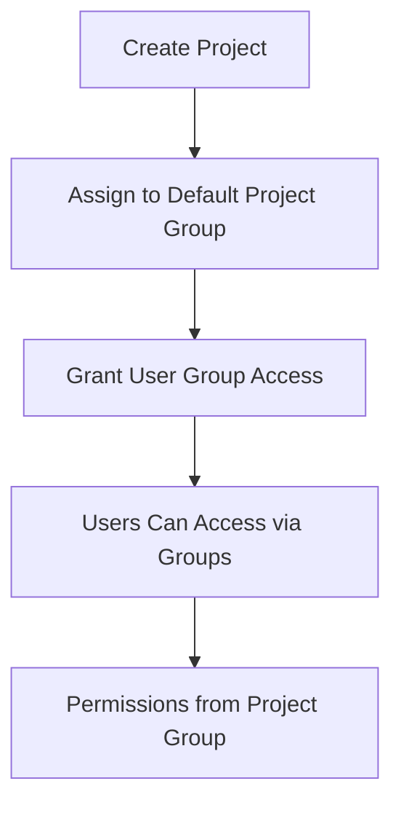

# Project Management API

Complete project management documentation for creating, reading, updating, and deleting projects with group-based access control.

## 🔐 Authentication Required

All endpoints require authentication:

```
Authorization: Bearer YOUR_SESSION_TOKEN
```

---

## 📋 Project CRUD Operations

### GET `/projects`

List projects based on user's access level and group memberships.

**Authentication:** Required

**Query Parameters:**
- `limit` (optional, default: 10): Number of projects to return
- `offset` (optional, default: 0): Number of projects to skip
- `search` (optional): Search term for project name or description

**Example Request:**
```bash
curl -X GET "http://localhost:8000/projects?limit=10&offset=0" \
  -H "Authorization: Bearer YOUR_SESSION_TOKEN"
```

**Response (200):**
```json
{
  "success": true,
  "projects": [
    {
      "project_hash": "abc123...",
      "project_name": "Main Project",
      "project_description": "Main application project",
      "access_level": "admin",
      "access_through": "user_group"
    }
  ],
  "pagination": {
    "limit": 10,
    "offset": 0,
    "total_count": 25,
    "has_more": true
  },
  "user_access_level": "admin"
}
```

---

### POST `/projects`

Create new project and assign it to default project group.

**Authentication:** Required (admin permission)

**Request Body** (JSON):
```json
{
  "project_name": "New Project",
  "project_description": "A new project"
}
```

**Example Request:**
```bash
curl -X POST "http://localhost:8000/projects" \
  -H "Authorization: Bearer YOUR_SESSION_TOKEN" \
  -H "Content-Type: application/json" \
  -d '{"project_name": "New Project", "project_description": "A new project"}'
```

**Response (200):**
```json
{
  "success": true,
  "message": "Project \"New Project\" created successfully",
  "project": {
    "project_hash": "new_project_hash...",
    "project_name": "New Project",
    "project_description": "A new project",
    "created_at": "2024-01-01T12:00:00Z"
  }
}
```

---

### GET `/projects/{project_hash}`

Get detailed project information with user's access context.

**Authentication:** Required (must have access to the project)

**Path Parameters:**
- `project_hash`: Hash of the project to retrieve

**Example Request:**
```bash
curl -X GET "http://localhost:8000/projects/abc123..." \
  -H "Authorization: Bearer YOUR_SESSION_TOKEN"
```

**Response (200):**
```json
{
  "success": true,
  "project": {
    "project_id": 1,
    "project_hash": "abc123...",
    "project_name": "Main Project",
    "project_description": "Main application project",
    "created_at": "2024-01-01T00:00:00Z",
    "is_active": true
  },
  "user_access": {
    "permissions": ["admin", "read", "write", "delete"],
    "access_level": "admin",
    "user_groups": ["administrators"]
  },
  "statistics": {
    "total_users": 15,
    "active_sessions": 8,
    "total_groups": 3
  }
}
```

---

### PUT `/projects/{project_hash}`

Update project information (admin only).

**Authentication:** Required (admin permission)

**Path Parameters:**
- `project_hash`: Hash of the project to update

**Request Body** (JSON):
```json
{
  "project_name": "Updated Project Name",
  "project_description": "Updated description"
}
```

**Example Request:**
```bash
curl -X PUT "http://localhost:8000/projects/abc123..." \
  -H "Authorization: Bearer YOUR_SESSION_TOKEN" \
  -H "Content-Type: application/json" \
  -d '{"project_name": "Updated Project Name"}'
```

**Response (200):**
```json
{
  "success": true,
  "message": "Project updated successfully",
  "project": {
    "project_id": 1,
    "project_hash": "abc123...",
    "project_name": "Updated Project Name",
    "project_description": "Updated description",
    "updated_by": 1
  }
}
```

---

### DELETE `/projects/{project_hash}`

Delete a project and revoke all user group access (admin only).

**Authentication:** Required (admin permission)

**Path Parameters:**
- `project_hash`: Hash of the project to delete

**Example Request:**
```bash
curl -X DELETE "http://localhost:8000/projects/abc123..." \
  -H "Authorization: Bearer YOUR_SESSION_TOKEN"
```

**Response (200):**
```json
{
  "success": true,
  "message": "Project \"My Project\" deleted successfully",
  "deleted_project": {
    "project_hash": "abc123...",
    "project_name": "My Project",
    "deleted_by": 1
  },
  "warning": "All user group access to this project has been revoked"
}
```

---

## 🏗️ Group-Based Project Access

### Understanding Project Access Control

Projects in this system use hierarchical group-based access:

```
User Groups → Define which projects users can access
Project Groups → Define what permissions users have in projects
```

### Access Levels

| Access Level | Description | Typical Groups |
|-------------|-------------|----------------|
| **admin** | Full project control | administrators |
| **write** | Can modify project data | users, contributors |
| **read** | View-only access | guests, viewers |

### Project Creation Flow



---

## 🧪 Testing Project Management

### Test Project CRUD Operations

```bash
#!/bin/bash

# Get admin session token
ADMIN_TOKEN=$(curl -s -X POST "http://localhost:8000/auth/login" \
  -H "Content-Type: application/x-www-form-urlencoded" \
  -d "username=admin&password=admin123&project_hash=EXISTING_PROJECT_HASH" | \
  jq -r '.session_token')

echo "1. Creating new project..."
CREATE_RESPONSE=$(curl -s -X POST "http://localhost:8000/projects" \
  -H "Authorization: Bearer $ADMIN_TOKEN" \
  -H "Content-Type: application/json" \
  -d '{"project_name": "Test Project", "project_description": "A test project"}')

echo "Create Response: $CREATE_RESPONSE"

# Extract project hash
PROJECT_HASH=$(echo $CREATE_RESPONSE | jq -r '.project.project_hash')

echo -e "\n2. Getting project details..."
curl -X GET "http://localhost:8000/projects/$PROJECT_HASH" \
  -H "Authorization: Bearer $ADMIN_TOKEN"

echo -e "\n3. Updating project..."
curl -X PUT "http://localhost:8000/projects/$PROJECT_HASH" \
  -H "Authorization: Bearer $ADMIN_TOKEN" \
  -H "Content-Type: application/json" \
  -d '{"project_name": "Updated Test Project"}'

echo -e "\n4. Listing all projects..."
curl -X GET "http://localhost:8000/projects" \
  -H "Authorization: Bearer $ADMIN_TOKEN"

echo -e "\n5. Deleting project..."
curl -X DELETE "http://localhost:8000/projects/$PROJECT_HASH" \
  -H "Authorization: Bearer $ADMIN_TOKEN"
```

### Test Project Access Control

```bash
#!/bin/bash

# Test access control for different user types
echo "1. Admin access to projects..."
ADMIN_TOKEN=$(curl -s -X POST "http://localhost:8000/auth/login" \
  -H "Content-Type: application/x-www-form-urlencoded" \
  -d "username=admin&password=admin123&project_hash=PROJECT_HASH" | \
  jq -r '.session_token')

curl -X GET "http://localhost:8000/projects" \
  -H "Authorization: Bearer $ADMIN_TOKEN"

echo -e "\n2. Regular user access to projects..."
USER_TOKEN=$(curl -s -X POST "http://localhost:8000/auth/login" \
  -H "Content-Type: application/x-www-form-urlencoded" \
  -d "username=user&password=userpass&project_hash=PROJECT_HASH" | \
  jq -r '.session_token')

curl -X GET "http://localhost:8000/projects" \
  -H "Authorization: Bearer $USER_TOKEN"

echo -e "\n3. Testing unauthorized project creation..."
curl -X POST "http://localhost:8000/projects" \
  -H "Authorization: Bearer $USER_TOKEN" \
  -H "Content-Type: application/json" \
  -d '{"project_name": "Unauthorized Project"}'
```

---

## 📚 SDK Examples

### Python SDK for Project Management

```python
import requests

class ProjectAPI:
    def __init__(self, base_url, session_token):
        self.base_url = base_url
        self.session_token = session_token
        self.headers = {"Authorization": f"Bearer {session_token}"}
    
    def list_projects(self, limit=10, offset=0, search=None):
        """List projects with pagination and search"""
        params = {"limit": limit, "offset": offset}
        if search:
            params["search"] = search
        
        response = requests.get(
            f"{self.base_url}/projects",
            headers=self.headers,
            params=params
        )
        return response.json()
    
    def get_project(self, project_hash):
        """Get detailed project information"""
        response = requests.get(
            f"{self.base_url}/projects/{project_hash}",
            headers=self.headers
        )
        return response.json()
    
    def create_project(self, project_name, project_description):
        """Create a new project"""
        response = requests.post(
            f"{self.base_url}/projects",
            headers={**self.headers, "Content-Type": "application/json"},
            json={
                "project_name": project_name,
                "project_description": project_description
            }
        )
        return response.json()
    
    def update_project(self, project_hash, **updates):
        """Update project information"""
        response = requests.put(
            f"{self.base_url}/projects/{project_hash}",
            headers={**self.headers, "Content-Type": "application/json"},
            json=updates
        )
        return response.json()
    
    def delete_project(self, project_hash):
        """Delete a project"""
        response = requests.delete(
            f"{self.base_url}/projects/{project_hash}",
            headers=self.headers
        )
        return response.json()
    
    def search_projects(self, search_term):
        """Search for projects by name or description"""
        return self.list_projects(search=search_term)

# Usage
project_api = ProjectAPI("http://localhost:8000", "your_session_token")

# List all accessible projects
projects = project_api.list_projects()
print(f"Total projects: {projects['pagination']['total_count']}")

# Create a new project
new_project = project_api.create_project(
    "My New Project",
    "Description of my new project"
)
print(f"Created project: {new_project['project']['project_name']}")

# Get project details
project_details = project_api.get_project(new_project['project']['project_hash'])
print(f"Project permissions: {project_details['user_access']['permissions']}")

# Update project
updated = project_api.update_project(
    new_project['project']['project_hash'],
    project_name="Updated Project Name"
)

# Search projects
results = project_api.search_projects("Updated")
print(f"Search results: {len(results['projects'])} projects found")
```

### JavaScript SDK for Project Management

```javascript
class ProjectAPI {
    constructor(baseUrl, sessionToken) {
        this.baseUrl = baseUrl;
        this.sessionToken = sessionToken;
        this.headers = {
            'Authorization': `Bearer ${sessionToken}`
        };
    }
    
    async listProjects(limit = 10, offset = 0, search = null) {
        const params = new URLSearchParams({ limit, offset });
        if (search) params.append('search', search);
        
        const response = await fetch(`${this.baseUrl}/projects?${params}`, {
            headers: this.headers
        });
        return await response.json();
    }
    
    async getProject(projectHash) {
        const response = await fetch(`${this.baseUrl}/projects/${projectHash}`, {
            headers: this.headers
        });
        return await response.json();
    }
    
    async createProject(projectName, projectDescription) {
        const response = await fetch(`${this.baseUrl}/projects`, {
            method: 'POST',
            headers: {
                ...this.headers,
                'Content-Type': 'application/json'
            },
            body: JSON.stringify({
                project_name: projectName,
                project_description: projectDescription
            })
        });
        return await response.json();
    }
    
    async updateProject(projectHash, updates) {
        const response = await fetch(`${this.baseUrl}/projects/${projectHash}`, {
            method: 'PUT',
            headers: {
                ...this.headers,
                'Content-Type': 'application/json'
            },
            body: JSON.stringify(updates)
        });
        return await response.json();
    }
    
    async deleteProject(projectHash) {
        const response = await fetch(`${this.baseUrl}/projects/${projectHash}`, {
            method: 'DELETE',
            headers: this.headers
        });
        return await response.json();
    }
    
    async searchProjects(searchTerm) {
        return await this.listProjects(10, 0, searchTerm);
    }
}

// Usage
const projectAPI = new ProjectAPI('http://localhost:8000', 'your_session_token');

// List all accessible projects
const projects = await projectAPI.listProjects();
console.log(`Total projects: ${projects.pagination.total_count}`);

// Create a new project
const newProject = await projectAPI.createProject(
    'My New Project',
    'Description of my new project'
);
console.log(`Created project: ${newProject.project.project_name}`);

// Get project details
const projectDetails = await projectAPI.getProject(newProject.project.project_hash);
console.log(`Project permissions: ${projectDetails.user_access.permissions}`);

// Update project
const updated = await projectAPI.updateProject(
    newProject.project.project_hash,
    { project_name: 'Updated Project Name' }
);

// Search projects
const results = await projectAPI.searchProjects('Updated');
console.log(`Search results: ${results.projects.length} projects found`);
```

---

## 🔧 Common Use Cases

### 1. Project Dashboard

```python
def create_project_dashboard(project_api):
    """Create a project dashboard with statistics"""
    projects = project_api.list_projects(limit=100)
    
    dashboard = {
        "total_projects": projects["pagination"]["total_count"],
        "projects": [],
        "user_access_level": projects["user_access_level"]
    }
    
    for project in projects["projects"]:
        project_details = project_api.get_project(project["project_hash"])
        dashboard["projects"].append({
            "name": project["project_name"],
            "description": project["project_description"],
            "access_level": project["access_level"],
            "users": project_details["statistics"]["total_users"],
            "active_sessions": project_details["statistics"]["active_sessions"]
        })
    
    return dashboard
```

### 2. Project Search and Filter

```javascript
async function searchAndFilterProjects(projectAPI, filters) {
    const { searchTerm, limit = 20, offset = 0 } = filters;
    
    try {
        const results = await projectAPI.listProjects(limit, offset, searchTerm);
        
        return {
            projects: results.projects.map(project => ({
                hash: project.project_hash,
                name: project.project_name,
                description: project.project_description,
                accessLevel: project.access_level,
                accessThrough: project.access_through
            })),
            pagination: results.pagination,
            totalFound: results.pagination.total_count
        };
    } catch (error) {
        console.error('Search failed:', error);
        return { projects: [], pagination: {}, totalFound: 0 };
    }
}
```

### 3. Project Permissions Checker

```python
def check_project_permissions(project_api, project_hash):
    """Check user's permissions for a specific project"""
    try:
        project_details = project_api.get_project(project_hash)
        
        permissions = project_details["user_access"]["permissions"]
        
        return {
            "can_read": "read" in permissions,
            "can_write": "write" in permissions,
            "can_delete": "delete" in permissions,
            "can_admin": "admin" in permissions,
            "access_level": project_details["user_access"]["access_level"],
            "user_groups": project_details["user_access"]["user_groups"]
        }
    except Exception as e:
        return {
            "error": str(e),
            "can_read": False,
            "can_write": False,
            "can_delete": False,
            "can_admin": False
        }
```

---

## 🛡️ Security and Access Control

### Project Access Security
- **Group-based access**: Only users whose groups have access can see projects
- **Permission validation**: Each operation checks specific permissions
- **Audit trail**: All project changes are logged with user context
- **Automatic cleanup**: Deleted projects remove all group access

### Permission Hierarchy
```
admin > write > read
```

### Access Control Matrix

| Permission | List Projects | View Project | Create Project | Update Project | Delete Project |
|------------|---------------|--------------|----------------|----------------|----------------|
| **admin** | ✅ All | ✅ Full Details | ✅ Yes | ✅ Yes | ✅ Yes |
| **write** | ✅ Accessible | ✅ Basic Details | ❌ No | ✅ Limited | ❌ No |
| **read** | ✅ Accessible | ✅ Basic Details | ❌ No | ❌ No | ❌ No |

### Group-Based Project Access
- **User groups** determine which projects a user can access
- **Project groups** determine what permissions the user has
- **Dynamic access**: Adding/removing group access immediately affects user access
- **Cross-project access**: Users can switch between accessible projects

---

**Next:** Learn about [Admin API](admin.md) for group management or [System API](system.md) for monitoring.