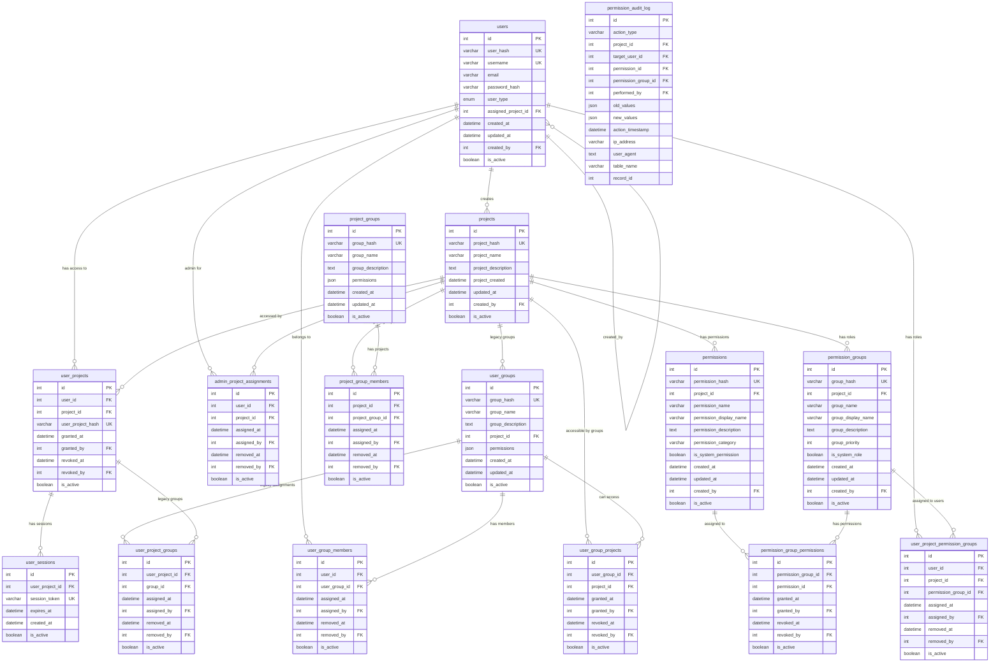

# Database Entity Relationship Diagram

## Overview

This document provides a visual representation of the database schema relationships.

## Complete ERD



## Key Relationships Explained

### User Type Hierarchy

1. **Root Users**: Have `user_type = 'root'` and no `assigned_project_id`
2. **Admin Users**: Have `user_type = 'admin'` with entries in `admin_project_assignments`
3. **Consumer Users**: Have `user_type = 'consumer'` and access projects through `user_projects`

### Permission Flow

```
User → User Groups → Projects (via user_group_projects)
User → Projects (via user_projects) → Permission Groups → Permissions
Admin User → Projects (via admin_project_assignments) → Full Admin Access
Root User → All Projects → Full Global Access
```

### RBAC Implementation

1. **Permissions** are defined per project
2. **Permission Groups** (roles) collect permissions
3. **Users** are assigned to permission groups within projects
4. All changes are tracked in **permission_audit_log**

## Table Categories

### Core Tables
- `users`: All user accounts
- `projects`: All applications/systems
- `user_projects`: Consumer user access to projects
- `admin_project_assignments`: Admin user project assignments

### Group Management
- `user_groups`: Global user organization
- `project_groups`: Project-level permission groups
- Various linking tables for memberships

### RBAC System
- `permissions`: Available permissions
- `permission_groups`: Role definitions
- `permission_group_permissions`: Role-permission mappings
- `user_project_permission_groups`: User-role assignments

### Support Tables
- `user_sessions`: Active sessions
- `permission_audit_log`: Complete audit trail
- `user_project_groups`: Legacy compatibility 