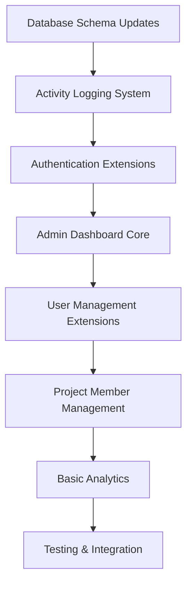
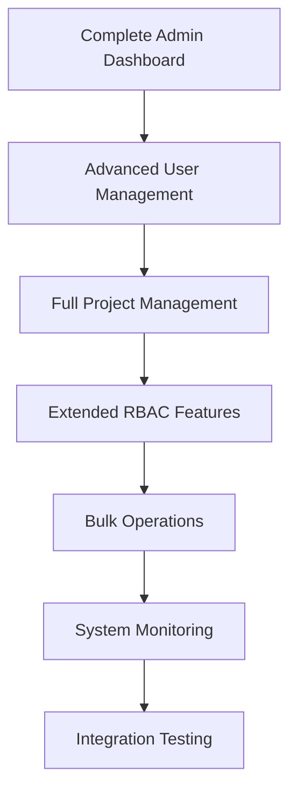
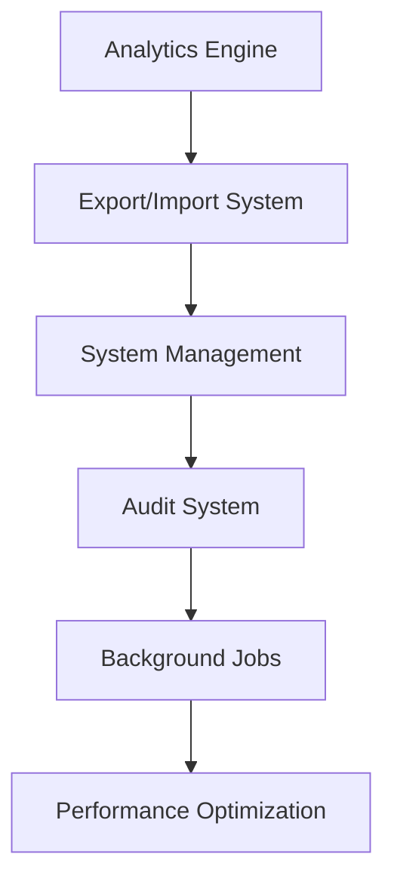
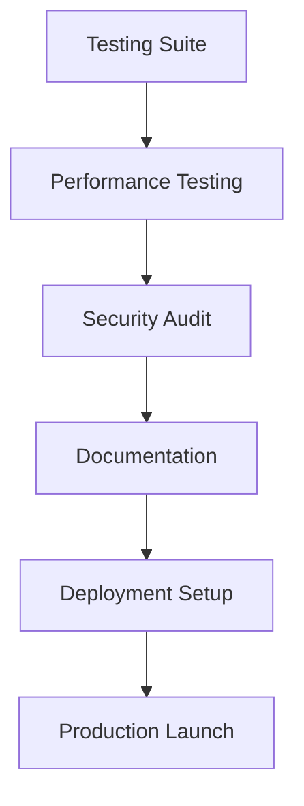

# Complete API Development Plan: Frontend-Backend Alignment

## 📊 Current State Analysis

Your Magic Auth Dashboard API currently has **20% endpoint coverage** with only 18 out of 89 expected endpoints implemented. This development plan will close the gap by implementing **71 missing endpoints** across 4 strategic phases.

### Existing Strong Foundation:
✅ **Authentication Core** - Login, register, validate, logout  
✅ **User Profile Management** - Profile CRUD operations  
✅ **3-Tier User System** - Root, admin, consumer hierarchy  
✅ **Basic Project Management** - Project CRUD operations  
✅ **User Groups Management** - Group-based access control  
✅ **RBAC System** - Role-based permissions  
✅ **System Health** - Health checks and basic monitoring  

### Critical Missing Components:
❌ **Admin Dashboard** (5 endpoints) - Dashboard statistics and overview  
❌ **Analytics System** (8 endpoints) - User and project analytics  
❌ **Extended User Management** (7 endpoints) - User listing, status, bulk ops  
❌ **Extended Project Management** (8 endpoints) - Members, activity, ownership  
❌ **Export/Import Operations** (3 endpoints) - Data export/import functionality  
❌ **Advanced System Management** (15 endpoints) - Sessions, audit, settings  
❌ **Bulk Operations** (2 endpoints) - Mass user operations  

---

## 🚀 4-Phase Development Strategy

### Phase 1: Critical MVP (Weeks 1-2) - 45 hours
**Priority: HIGH** - Essential for basic dashboard functionality

#### Key Deliverables:
- ✅ Authentication refresh endpoint
- ✅ Admin dashboard statistics
- ✅ User listing and status management
- ✅ Project member management
- ✅ Basic analytics foundation
- ✅ Activity logging system

#### Critical Endpoints:
```
POST /auth/refresh
GET /admin/dashboard/stats
GET /admin/activity
GET /users
GET /users/{user_hash}
PATCH /users/{user_hash}/status
GET /projects/{project_hash}/members
POST /projects/{project_hash}/members
GET /analytics/dashboard/stats
```

#### Infrastructure Changes:
- Add `is_active` field to users table
- Create `activity_logs` table
- Implement activity logging system
- Enhance session management

---

### Phase 2: Core Features (Weeks 3-4) - 85 hours
**Priority: MEDIUM** - Complete dashboard functionality

#### Key Deliverables:
- ✅ Complete admin dashboard with all statistics
- ✅ Full user management capabilities
- ✅ Advanced project management features
- ✅ Extended group management
- ✅ Advanced RBAC features
- ✅ Bulk operations foundation

#### Major Features:
- User statistics and analytics
- Project statistics and health metrics
- Project ownership transfer
- Project archiving
- Bulk user operations
- Permission matrix view
- Role assignment history

#### Infrastructure Changes:
- Add project status fields (`archived`, `owner_id`)
- Create role assignment history table
- Implement audit trail system
- Add system metrics tracking

---

### Phase 3: Advanced Features (Weeks 5-6) - 156 hours
**Priority: LOW** - Advanced functionality

#### Key Deliverables:
- ✅ Complete analytics system with all metrics
- ✅ Export/import functionality
- ✅ Advanced system management
- ✅ Comprehensive audit logging
- ✅ System settings management
- ✅ Session management capabilities
- ✅ Backup system

#### Advanced Features:
- User behavior analytics
- Project performance analytics
- Data export (CSV/JSON)
- User import with validation
- System backup functionality
- Performance monitoring
- Session termination

#### Infrastructure Changes:
- User behavior tracking tables
- Analytics aggregation tables
- Export job tracking
- Backup job management
- System settings storage
- Background job queue (Redis/Celery)

---

### Phase 4: Testing & Production (Weeks 7-8) - 222 hours
**Priority: CRITICAL** - Production readiness

#### Key Deliverables:
- ✅ Comprehensive testing suite (90%+ coverage)
- ✅ Performance optimization
- ✅ Complete API documentation
- ✅ Security hardening
- ✅ Database migrations
- ✅ Production deployment readiness

#### Quality Assurance:
- Unit tests for all endpoints
- Integration tests for workflows
- Performance testing (1000+ concurrent users)
- Security audit and hardening
- Load testing and optimization
- Documentation and deployment guides

---

## 📋 Implementation Roadmap

### Week 1-2: Critical MVP Foundation


### Week 3-4: Core Feature Completion


### Week 5-6: Advanced Features


### Week 7-8: Production Readiness


---

## 🏗️ File Structure Changes

### New Route Files:
```
src/routes/
├── admin_dashboard.py      # Phase 1
├── analytics.py           # Phase 1 & 3
├── bulk_operations.py     # Phase 2
└── export_import.py       # Phase 3
```

### Extended Existing Files:
```
src/routes/
├── auth.py                # Add refresh endpoint
├── users.py               # Add listing, status management
├── projects.py            # Add member management, stats
├── admin_user_groups.py   # Add member listing, bulk ops
├── rbac.py                # Add matrix view, history
└── system.py              # Add admin management, sessions
```

### New Utility Modules:
```
src/Util/
├── activity_logger.py     # Phase 1
├── analytics_engine.py    # Phase 3
├── bulk_operations.py     # Phase 2
├── export_manager.py      # Phase 3
├── import_manager.py      # Phase 3
├── backup_manager.py      # Phase 3
├── audit_logger.py        # Phase 3
└── settings_manager.py    # Phase 3
```

---

## 💾 Database Schema Changes

### Phase 1 Schema Updates:
```sql
-- Add user status field
ALTER TABLE users ADD COLUMN is_active BOOLEAN DEFAULT TRUE;

-- Create activity logs table
CREATE TABLE activity_logs (
    id SERIAL PRIMARY KEY,
    user_id INTEGER REFERENCES users(id),
    action VARCHAR(100) NOT NULL,
    details JSONB,
    ip_address INET,
    timestamp TIMESTAMP DEFAULT CURRENT_TIMESTAMP
);
```

### Phase 2 Schema Updates:
```sql
-- Add project status fields
ALTER TABLE projects ADD COLUMN archived BOOLEAN DEFAULT FALSE;
ALTER TABLE projects ADD COLUMN owner_id INTEGER REFERENCES users(id);

-- Create role assignment history
CREATE TABLE role_assignment_history (
    id SERIAL PRIMARY KEY,
    user_id INTEGER REFERENCES users(id),
    project_id INTEGER REFERENCES projects(id),
    role_id INTEGER,
    action VARCHAR(20), -- 'assigned' or 'removed'
    assigned_by INTEGER REFERENCES users(id),
    timestamp TIMESTAMP DEFAULT CURRENT_TIMESTAMP
);
```

### Phase 3 Schema Updates:
```sql
-- User analytics tracking
CREATE TABLE user_analytics (
    id SERIAL PRIMARY KEY,
    user_id INTEGER REFERENCES users(id),
    date DATE,
    login_count INTEGER DEFAULT 0,
    activity_score INTEGER DEFAULT 0,
    last_activity TIMESTAMP
);

-- System settings
CREATE TABLE system_settings (
    key VARCHAR(100) PRIMARY KEY,
    value JSONB,
    updated_by INTEGER REFERENCES users(id),
    updated_at TIMESTAMP DEFAULT CURRENT_TIMESTAMP
);

-- Export jobs tracking
CREATE TABLE export_jobs (
    id SERIAL PRIMARY KEY,
    job_type VARCHAR(50),
    status VARCHAR(20),
    file_path VARCHAR(500),
    created_by INTEGER REFERENCES users(id),
    created_at TIMESTAMP DEFAULT CURRENT_TIMESTAMP,
    completed_at TIMESTAMP
);
```

---

## 🔧 Infrastructure Requirements

### Development Environment:
- **Python 3.8+** with FastAPI
- **PostgreSQL 12+** for database
- **Redis 6+** for caching and job queue
- **Docker & Docker Compose** for containerization

### New Dependencies:
```python
# Phase 3 additions to requirements.txt
pandas>=1.5.0          # Data export/import
celery>=5.3.0          # Background jobs
redis>=4.5.0           # Job queue
psutil>=5.9.0          # System metrics
alembic>=1.8.0         # Database migrations
pytest>=7.0.0          # Testing framework
pytest-asyncio>=0.20.0 # Async testing
locust>=2.0.0          # Load testing
```

### Production Infrastructure:
- **Load Balancer** for API scaling
- **Redis Cluster** for high availability
- **File Storage** for exports and backups
- **Monitoring Stack** (Prometheus, Grafana)
- **Log Aggregation** (ELK Stack or similar)

---

## ⚡ Performance Targets

### Response Time Goals:
- **Dashboard Stats**: <100ms
- **User Listing**: <200ms (paginated)
- **Analytics Queries**: <500ms (with caching)
- **Export Operations**: Async background jobs
- **Bulk Operations**: <5 seconds for 100 users

### Scalability Targets:
- **Concurrent Users**: 1,000+
- **Database Connections**: Optimized pooling
- **Memory Usage**: <2GB per instance
- **Cache Hit Rate**: >90% for frequently accessed data

---

## 🔒 Security Considerations

### Authentication & Authorization:
- ✅ All admin endpoints require proper role verification
- ✅ Bulk operations limited to admin users
- ✅ Session management with secure tokens
- ✅ Rate limiting on all endpoints

### Data Protection:
- ✅ Input validation and sanitization
- ✅ SQL injection prevention
- ✅ CORS configuration
- ✅ Audit trail for all admin actions

### Production Security:
- ✅ HTTPS enforcement
- ✅ Environment variable secrets
- ✅ Database encryption at rest
- ✅ Regular security updates

---

## 📈 Success Metrics

### Development Success:
- [ ] **100% Endpoint Coverage** (71 new endpoints)
- [ ] **90%+ Test Coverage** on new code
- [ ] **<200ms Response Times** for critical endpoints
- [ ] **Zero Security Vulnerabilities** in audit

### Business Success:
- [ ] **Frontend Integration** completed
- [ ] **Admin Dashboard** fully functional
- [ ] **User Management** streamlined
- [ ] **Analytics Insights** available
- [ ] **Production Deployment** successful

---

## 🎯 Next Steps

### Immediate Actions (Week 1):
1. **Review and approve** this development plan
2. **Set up development environment** with new dependencies
3. **Create database backup** before schema changes
4. **Begin Phase 1 implementation** with authentication extensions
5. **Set up project tracking** (Jira, GitHub Issues, etc.)

### Team Coordination:
- **Backend Developer**: Focus on API implementation
- **Frontend Developer**: Prepare for new endpoint integration
- **DevOps Engineer**: Set up infrastructure requirements
- **QA Engineer**: Prepare testing frameworks

### Risk Mitigation:
- **Incremental Deployment**: Deploy and test each phase separately
- **Rollback Plan**: Maintain database migration rollback scripts
- **Feature Flags**: Use feature toggles for new functionality
- **Monitoring**: Set up alerts for new endpoints

---

**Total Project Timeline: 10-14 weeks**  
**Total Development Effort: ~508 hours**  
**Expected Outcome: Complete frontend-backend API alignment**

This comprehensive plan will transform your API from 20% coverage to 100% coverage, enabling full frontend functionality and providing a robust, scalable authentication and management system. 